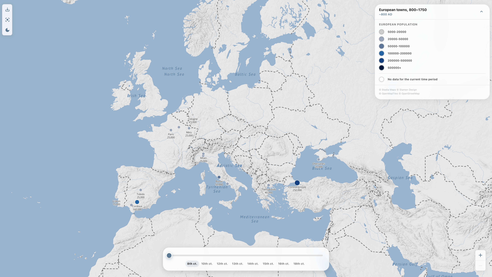

# European towns, 800–1750

[](https://github.com/a-a-m-k/historical-europe-map/actions/workflows/ci.yml)

Interactive map of European town populations from 800 to 1750. Change century on the timeline to filter towns; marker size reflects population, and the map reframes so the data stays in view.

**Live:** https://a-a-m-k.github.io/historical-europe-map/

Personal **showcase / portfolio** project — not open for contributions or issue triage.



## What’s in it

- **Map:** MapLibre GL + React Map GL, Stadia terrain tiles, custom zoom-to-fit and pan limits.
- **UI:** React 18, TypeScript, Vite, MUI v6. Timeline, legend, screenshot export, PWA with a small service worker (cache-first for hashed assets).
- **Quality:** Error boundaries, keyboard/screen-reader support, Vitest + Playwright, ESLint/Prettier, Husky, GitHub Actions (CI + Pages).

## Project structure

Single-page app (no client router): everything mounts from `MapPage`.

```
src/
├── App.tsx, main.tsx, index.css
├── assets/           # Terrain GL styles, towns GeoJSON bundle, icons
├── common/           # Small cross-cutting types (timeline marks, legend items)
├── components/
│   ├── controls/     # Timeline, legend shell, screenshot, map controls
│   ├── layouts/      # MapScreen (fetch + provider), MapLayout, MapLegendColumn, MapStage
│   ├── map/          # MapView, MapCanvasStack, MapViewShell, TownMarkers, style toggle
│   ├── ui/           # ErrorOverlay, LoadingSpinner, shared buttons
│   └── dev/          # ErrorBoundary, dev helpers (lazy-loaded in dev)
├── context/          # AppContext + useYearDataController; MapStyleContext (basemap mode)
├── hooks/
│   ├── map/          # activation/, camera/, data/, interactions/, runtime/ + useMapViewOrchestration
│   ├── ui/           # Viewport, responsive layout, screenshot, reduced motion, …
│   └── legend/       # Legend layer wiring for the map
├── locales/          # UI copy
├── pages/            # MapPage (API key gate + viewport shell)
├── services/         # YearDataService (fetch, abort, LRU)
├── types/            # e.g. shared map view typing
├── theme/            # MUI theme, map-adjacent tokens
├── ui/               # Legend presentation (Legend, LegendItem, …) composed by layouts/controls
└── utils/            # map/ (barrel `@/utils/map`), mapZoom, markers, legend, screenshot, cache, …
```

## Architecture notes

- **Render flow:** `App` → theme/style providers + `ErrorBoundary` → `MapPage` (checks `VITE_STADIA_API_KEY`) → `MapScreen` (`useTownsData`, then `AppProvider` + `MapLayout`) → lazy `MapStage` → `MapView` / `MapCanvasStack`. Map style mode lives in `MapStyleContext` outside `AppContext` so basemap toggles do not reload town data.
- **Data flow:** Raw towns load in `useTownsData` (`hooks/map/data`; re-exported from `@/hooks/map` and `@/hooks`). Year-scoped filtering and loading/error for the map UI come from `useYearDataController` inside `AppProvider` and are read via `useApp()` (`selectedYear`, `filteredTowns`, `isYearDataLoading`, `yearDataError`, `retryYearData`, …).
- **Map rendering split:** `useMapViewOrchestration` composes camera, interactions, and runtime hooks; `MapView` is a thin shell. `MapCanvasStack` owns MapLibre instances and style lifecycle; markers and labels live under `MapView/TownMarkers`. `MapLayout` handles activation gating, stable map `key` by device class, and initial camera / resize refit using hooks + `utils/map` and `mapZoom`.
- **Derived-data caching:** `YearDataService` uses LRU caches and stable cache keys so timeline scrubbing avoids repeated heavy work.
- **Zoom-to-fit:** `getZoomToFitBounds` in `src/utils/mapZoom.ts` uses Mercator-aware math and the smaller of lat/lon zoom limits; `calculateMapArea` subtracts legend/timeline chrome so fits use the real map viewport.
- **Error handling policy:** User-facing messages and reporting go through `src/utils/errorPolicy.ts`, with accessibility announcements where it matters.
- **Observability:** Structured log lines for timings and events (`src/utils/observability.ts`).

## Style ownership boundaries

- **`src/index.css`:** global reset, a11y helpers, allowlisted shared selectors only (`npm run lint:css-boundaries` guards this).
- **`src/theme/*` and component styles:** everything else; add new globals to CSS only after review (`scripts/check-index-css-boundaries.cjs`).

## Quick start

**Prereqs:** Node 20+, npm, and a [Stadia Maps API key](https://client.stadiamaps.com/). For E2E tests, run `npm run test:e2e:install` once to install Playwright browsers.

```bash
git clone https://github.com/a-a-m-k/historical-europe-map.git
cd historical-europe-map
npm install
cp .env.example .env
```

In `.env` set `VITE_STADIA_API_KEY=your-key`. Then:

```bash
npm run dev
```

Open http://localhost:5173

| Env var               | Required | Description                     |
| --------------------- | -------- | ------------------------------- |
| `VITE_STADIA_API_KEY` | Yes      | Stadia Maps key for tiles       |
| `VITE_BASE_PATH`      | No       | e.g. `/historical-europe-map/` for GitHub Pages |

**Key restriction:** In the [Stadia Maps dashboard](https://client.stadiamaps.com/), restrict the API key by HTTP referrer or domain (e.g. `https://a-a-m-k.github.io/historical-europe-map/*` for GitHub Pages and `http://localhost:*` for local dev) so the key cannot be used from other origins.

## Scripts

| Command                    | Description                                                               |
| -------------------------- | ------------------------------------------------------------------------- |
| `npm run dev`              | Dev server                                                                |
| `npm run build`            | Production build                                                          |
| `npm run test:run`         | Run tests                                                                 |
| `npm run test:unit`        | Run unit tests (`tests/unit`)                                             |
| `npm run test:integration` | Run integration tests (`tests/integration`)                               |
| `npm run test:coverage`    | Tests + coverage (local profile)                                          |
| `npm run test:coverage:ci` | CI-style coverage (dot reporter + coverage ratchet)                       |
| `npm run test:e2e`         | Playwright E2E                                                            |
| `npm run test:pyramid`     | Run unit + integration + e2e lanes                                        |
| `npm run test:e2e:install` | Install Playwright browsers (run once before first `test:e2e`)            |
| `npm run lint`             | Lint (with fixes)                                                         |
| `npm run lint:check`       | Lint (CI mode, max-warnings 0)                                            |
| `npm run typecheck`        | TypeScript (`tsc --noEmit`)                                               |
| `npm run verify:ci`        | Lint, types, tests, and GitHub Pages build checks (matches CI except E2E) |
| `npm run build:check`      | `vite build` + bundle budget                                              |
| `npm run deploy`           | Deploy to GitHub Pages                                                    |

## Quality targets

Thresholds live in `vitest.config.ts` (coverage on `src/**/*.{ts,tsx}` excluding a few entry/type files): **statements, branches, and lines ≥75%**; **functions ≥70%**.

CI runs `npm run test:coverage:ci` (full Vitest run + dot reporter + ratchet via `scripts/check-coverage-ratchet.cjs` / `config/coverage-ratchet.json`). Other jobs: lint + typecheck, `test:integration` then `test:coverage:ci`, E2E (`npm run test:e2e`; `@visual` via `npm run test:visual`), build + `check-bundle-size.js`. Nightly: `npm run test:pyramid`. If you require specific checks in GitHub, match the workflow job **name** fields.

Bundle: gzip budgets in `scripts/check-bundle-size.js`; Vite `chunkSizeWarningLimit` **1200** only suppresses expected noise from the large MapLibre chunk.

## Deploy (GitHub Pages)

**Pages:** Repo **Settings → Pages → Source: GitHub Actions** (required for deploy). Set repo secret `VITE_STADIA_API_KEY`; restrict the key in the Stadia dashboard to your Pages origin and localhost. Pushes to `main` deploy via Actions; `npm run deploy` is a manual `gh-pages` fallback.

```bash
gh secret set VITE_STADIA_API_KEY --repo a-a-m-k/historical-europe-map
```

**CSP (GitHub Pages):** `script-src 'self'` in production; `style-src 'unsafe-inline'` kept for MUI/Emotion. Policy is meta-based (no header CSP), so devtools may still warn.

**After deploy:** Confirm the workflow is green, then smoke-test the live site (year change, screenshot, pan/zoom).

## License and attribution

Application source is licensed under the [MIT License](LICENSE).

Map data and tiles: Stadia Maps, Stamen Design, OpenMapTiles, OpenStreetMap.
